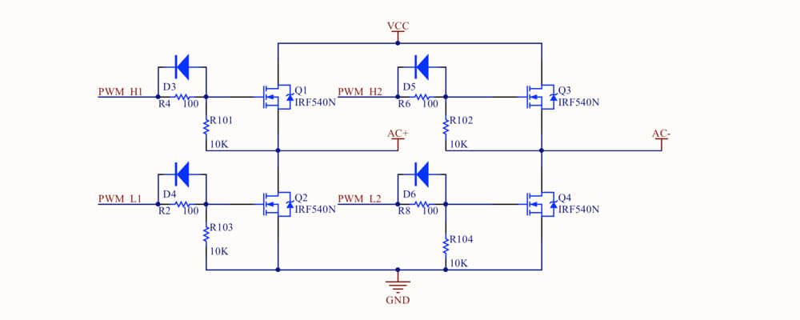
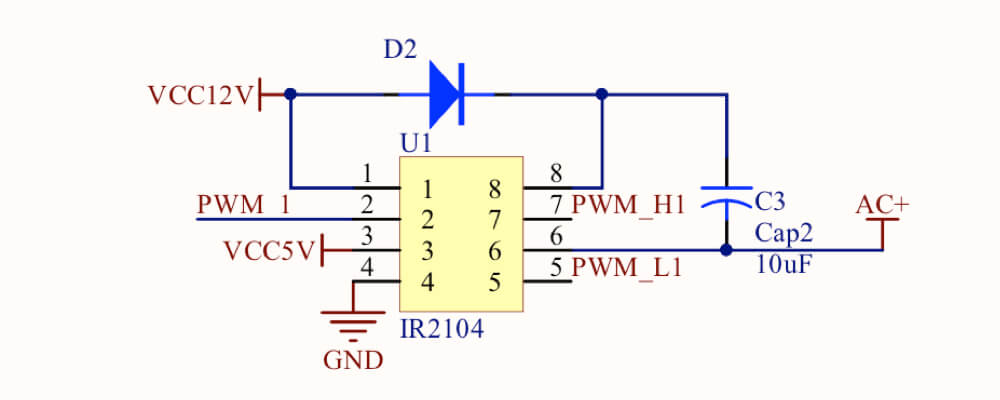

简单的直流电与交流电相互转换模块

-------

   

For English version [English Documentation](../README.md).

# 模块描述

全桥可控逆变整流器模块是一块可移植性、可编程性以及通用性都较高的电源模块。只需两根信号线即可控制全桥电路，实现直流电压与交流电压的相互转换。模块中的开关器件均可控，可以适应不同的运行状态。系统效率最高峰值可达到94%。

# 功能特性

模块具备一下功能特性：

- 模块支持PWM、SPWM等控制信号，每只桥臂仅需一根信号线控制。
- 上下桥臂内置死区，无需担心短路问题。
- MOSFIT管基极具有电荷释放电路，防止电荷积累击穿MOS管。
- 驱动电阻方便更换调整。
- 使用电阻更小的香蕉头接线柱。

**注意：此模块需要另外的12V或者5V为内置芯片供电。**

# 数据参数

具体参数可参考下表：

**⚠️警告⚠️**
1. 由于作者精力有限，峰值电压为推测值，未经过严格的可靠性测试。所以峰值电压不代表您可以在此条件下正常工作。请保护好自己的安全！
2. 建议典型值为作者实验与测试使用的数值，当您选择供电参数时，建议您查看元件的datasheet分析耐压值。

项目|峰值|建议典型值
:-|:-:|:-:
输入电压|0V～100V|10V～60V
输出电压（有效值）|0V～120V|36V
输入电流|0A～4A|0A～2A
输出电流|0A～4A|0A～2A
内置芯片供电电压|0V～12V|5V、12V
控制信号电压|0V～5V|5V、3.3V

# 元件需求

本模块需要以下芯片与晶体管（常用电子元件以及封装请查看工程文档）：

- IRF540N
- IR2104S

# 电路分析与注意事项

## 逆变与整流电路

电路下图所示：

其中R2、R4、R6、R8是较为重要的元件，电阻的作用是在基极状态变换时缓解电压突变、而电流无法突变时，对MOSFIT产生的巨大冲击。其阻值微小的变化就可能对输出波形的尖峰与振铃带来可观的缓解。

另外也可以通过在直流电对地并联大容量电解电容、高频陶瓷电容缓解电压中的不稳定因素。

## 驱动控制电路

电路图如下：

此电路中，C3自举电容的作用将成为理解电路的关键。自举电容就是在低端管开通时充电积攒电压；在高端管将要开通时，将积攒的电压叠加在源极上传输给基极，实现高端管的开通。此电容的容值不必很大，使用钽电容也可达到同样的效果。

IR2104可以使用同一电压进行供电。管脚3为使能端。

# 软件支持

您可以使用各类MCU、FPGA，生成驱动能力较强的PWM、SPWM波形，为模块提供控制信号。建议添加光耦隔离对主控进行保护。

作者使用STM32F407最小系统板，利用内置时钟直接生成PWM与SPWM波供给模块，亦可应付大部分应用场景。

# 版本更新

- v1.0 正常使用。正式开源
- v1.0-early1 第二次打样，测试无问题。
- v1.0-early 第一次打样，发现问题，重新布局。

# License

本作品遵循MIT开源协议。您可以自由的再创作，但必须注明本作者。